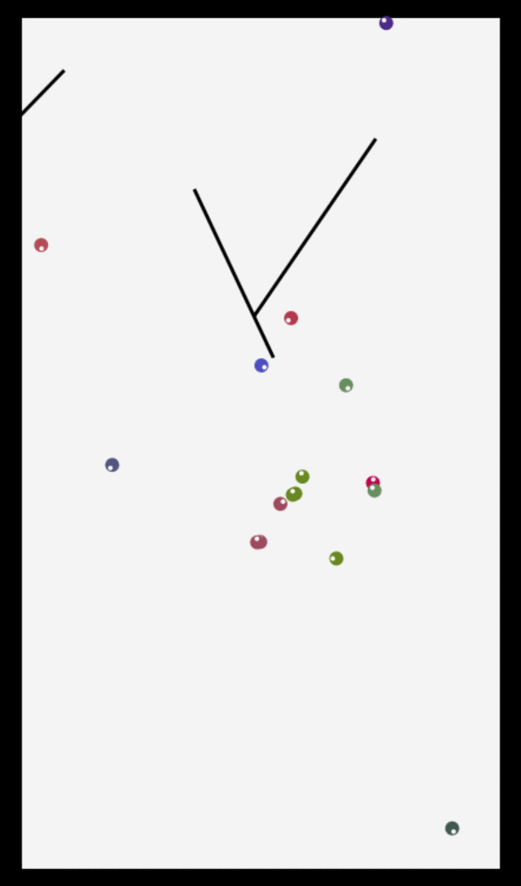

## CreatureBox
CreatureBox is a simple evolutionary obstacle avoidance demo inspired by [studio otoro](http://otoro.net)'s [creatures avoiding planks](http://blog.otoro.net/2015/05/07/creatures-avoiding-planks/).
I wanted to build something similar for fun and try out golang's [Go mobile](https://github.com/golang/mobile) project as well; this is the result. CreatureBox should work on Windows, OS X, Linux, Android, and iOS but has only been tested on OS X El Capitan and Android Marshmallow.

You can now read more about it on [my blog post](https://bentheelder.github.io/blog/creaturebox.html)  if you like.

CreatureBox on OS X:

</img>

Note: This is a 4fps gif, the app was running much more smoothly.

## Design
###### Project layout
The project is divided into the application layer (`main.go`), and the simulation (`sim.go`) with "brain" implementation further separated in `brain.go`. The simulation uses the go standard library and the excellent [draw2d](https://github.com/llgcode/draw2d) package and should be very portable.

###### Simulation
The design of the simulation itself is very similar to the creatures avoiding planks demo with simpler visualizations and slightly different "brains" and obstacles, as well as a different evolution mechanism described below.

###### Obstacles
A number of moving obstacles will spawn with random settings throughout the simulation for the creatures to avoid, touching one or the edge of the simulation will "kill" the creature.

###### "Brains"
Each creature has a fully connected two layer (input and output) neural network. Most of the outputs are recurrent like the [studio otoro](http://otoro.net) demo.
Each creature receives a number of "distance to edge or obstacle" inputs in evenly distributed directions about them as well as the previous output for the recurrent nodes, and produces a turn and move output used for turning left/right and moving forward/backwards every frame. These are then scaled, and applied. You can see which way a creature is facing by the white dot drawn on them towards their current "forward" direction.

###### Evolution
Every n-th frame a number of new creatures are spawned, some of which have brain patterns cloned from the all time best creatures so far, some with a combination of two of the best, and some purely random.
Eventually creatures better at staying alive will become more common but there will always be purely random creatures. Creatures do not "breed" or "grow" like the studio otoro demo, but they do have a "frames alive" score used to determine which brain patterns perform best.

The color of each creature is based on the average of their brain weights divided into 3 chunks for the RGB channels allowing some limited visualization of similarity between creatures ("clones" will be the same color for example).

## Installation
 - You will need to clone or download the repository and have [go](https://golang.org) installed.

 - Then follow the instructions at https://github.com/golang/go/wiki/Mobile to set up the Go mobile library and tooling

 - You then either need to install [godep](https://github.com/tools/godep) (preferable) or install the [draw2d](https://github.com/llgcode/draw2d) packages.

 - Finally use `godep go build` or `go build` to build for pc/linxu/mac and `gomobile build` to build for android if you have the android sdk setup with gomobile. You can also use `gomobile install` to install to android over [adb](http://developer.android.com/tools/help/adb.html).

## License
CreatureBox is licensed under the [Apache v2.0 License](http://www.apache.org/licenses/LICENSE-2.0), see the included LICENSE file.